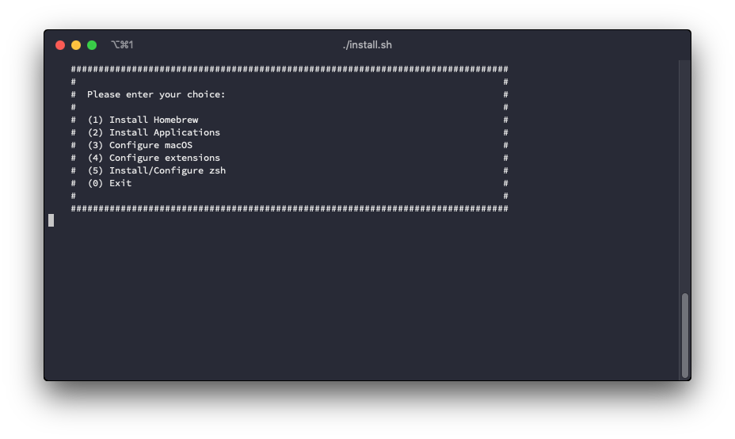

<div align="center">

[](https://github.com/manubermu/dotfiles/blob/master/LICENSE)
[](https://github.com/manubermu/dotfiles/releases)

</div>

## 📋 Index
- [What is a Dotfile?](#what)
- [Why would I want my dotfiles on GitHub?](#why)
- [Installation Guide](#install)
- [Organization of the repository](#organization)
- [Contribute](#contribute)
- [Acknowledgements](#acknowledgements)
- [My social networks](#social)
 	
## <a name="what"></a>🙋‍♂️ What is a Dotfile?

According to [Matthew Broberg](https://opensource.com/article/19/3/move-your-dotfiles-version-control):

> "Dotfiles" is a common term for all the configuration files we have floating around our machines. These files usually start with a . at the beginning of the filename, like .gitconfig, and operating systems often hide them by default.

## <a name="why"></a>🤷‍♂️ Why would I want my dotfiles on GitHub?

According to [here](https://dotfiles.github.io):

> Backup, restore, and sync the prefs and settings for your toolbox. Your dotfiles might be the most important files on your machine.
Learn from the community. Discover new tools for your toolbox and new tricks for the ones you already use.
Share what you’ve learned with the rest of us.

## <a name="install"></a>💻 Installation Guide

**Note:** Tested on macOS Mojave 10.14.6 Mac Mini (Mid 2011) with [macOS Mojave Patcher Tool for Unsupported Macs](http://dosdude1.com/mojave/).

1. Open the **Terminal** app.

2. Clone this repository on your on your /Documents directory and enter to the created directory. (If you don't have git installed on your computer, you can download the latest version from [here](https://github.com/manubermu/dotfiles/releases).)

	```Bash
	$ cd /Users/<your_username>/Documents
	$ git clone https://github.com/manubermu/dotfiles.git
	$ cd dotfiles
	```

3. Run the script `./install.sh` located on your folder.

	```bash
	$ chmod +x install.sh && ./install.sh
	```
	
4. Now, a menu will appear with the different options offered by the script:

	
	
	* **Install Homebrew:** First install `XCode CL tools` and then `Homebrew`.
	* **Install Applications:** It installs all the applications collected in the file `Brewfile`, located in `/install/profile/`
	* **Configure macOS:** Configure Git, create _dev_ folders, download Python libraries, configure _Dock_, _Finder_ and `Transmission.app`.
	* **Configure extensions:** Reads the extensions of a plain text file and sets as default editor `Sublime Text 3.app` and media player `IINA.app`
	* **Install/Configure zsh:** Install and configure `Zsh` and download plugins.
	* **Exit:** Finish the execution of the script.

## <a name="organization"></a>🗂 Organization of the repository

After reading documentation and seeing examples on Github about the _dotfiles_, I realized that each person has a different organization of them.

Therefore, I have adapted all of them to my way of programming and keeping the documents in my computer. The result can be seen in the following tree:

```
.
├── LICENSE
├── README.md
├── config
│   ├── duti
│   │   ├── iina.txt
│   │   ├── set.sh
│   │   └── sourcecode.txt
│   ├── git
│   └── macos.sh
├── doc
│   └── img
│       ├── logo-dotfiles.png
│       └── options-menu.png
├── install
│   ├── applications.sh
│   ├── hombrew.sh
│   └── profile
│       └── Brewfile
├── install.sh
├── iterm
│   └── com.googlecode.iterm2.plist
└── zsh
    └── zsh.sh

```
## <a name="contribute"></a>💬 Contribute

This project as I started as something personal but any help, criticism or improvement is welcome.

* To report any kind of problem or suggest modifications/additions, you can do it by creating an [new issue](https://github.com/manubermu/dotfiles/issues).

* Have you done better in the code and want to share it? [Propose a pull request](https://github.com/manubermu/dotfiles/pulls).

## <a name="acknowledgements"></a>👏 Acknowledgements

I would like to thank the following developers, who have published their dotfiles publicly for everyone to see. Thanks to them I have been able to realize this small project that I hope will help other developers.

* [@mathiasbynens](https://github.com/mathiasbynens) and his [dotfiles](https://github.com/mathiasbynens/dotfiles)
* [@MarioCatuogno](https://github.com/MarioCatuogno) and his [dotfiles](https://github.com/MarioCatuogno/Clean-macOS)

Main image extracted from [Github does dotfiles](https://dotfiles.github.io)

## <a name="social"></a>📱 My social networks

You can find me on the following social networks:

* **Twitter:** [https://twitter.com/manubermu](https://twitter.com/manubermu)
* **LinkedIn:** [https://www.linkedin.com/in/manuelbermudezmartinez/](https://www.linkedin.com/in/manuelbermudezmartinez/)
* **Website:** [manubermu.com](https://manubermu.com)
* **Mail:** [manubermu@pm.me](mailto:manubermu@pm.me)
